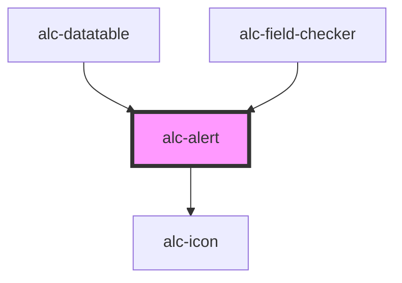

<!-- Auto Generated Below -->

## Overview

Vamos lá testar.
Ver se isso vai funcionar.
^^^^^ [1]

## Usage

### Básico

<alc-alert>
  O alert mais simples possível, sem alterações nas propriedades.
</alc-alert>

### Usando o sumário

<alc-alert dismissible="false">
  Prazo encerrado.
  O prazo para as inscrições foi encerrado no dia 26/01/2022.
</alc-alert>

## Properties

| Property      | Attribute     | Description                                                                                 | Type                                          | Default  |
| ------------- | ------------- | ------------------------------------------------------------------------------------------- | --------------------------------------------- | -------- |
| `dismissible` | `dismissible` | Define se o alert pode ser dispensado pelo usuário.                                         | `boolean`                                     | `true`   |
| `type`        | `type`        | O tipo do alert, de acordo com a natureza da mensagem nele contido.                         | `"error" \| "info" \| "success" \| "warning"` | `'info'` |
| `visible`     | `visible`     | Indica se o alert está visível. Pode-se usar essa propriedade em vez dos métodos show/hide. | `boolean`                                     | `true`   |

## Events

| Event            | Description                                   | Type                |
| ---------------- | --------------------------------------------- | ------------------- |
| `alc-after-hide` | Evento disparado quando o alert é dispensado. | `CustomEvent<null>` |
| `alc-hide`       | Evento disparado quando o alert é dispensado. | `CustomEvent<null>` |

## Methods

### `hide() => Promise<boolean>`

Fecha o alert.

#### Returns

Type: `Promise<boolean>`

O valor retornado é `true` se o alert foi realmente dispensado com essa chamada ao método.

### `show() => Promise<boolean>`

Exibe o alert.

#### Returns

Type: `Promise<boolean>`

O valor retornado é `true` se o alert foi realmente exibido com esa chamada ao método.

## Slots

| Slot        | Description                    |
| ----------- | ------------------------------ |
|             | Slot para o conteúdo do alert. |
| `"summary"` | Slot para o summary do alert.  |

## CSS Custom Properties

| Name                     | Description               |
| ------------------------ | ------------------------- |
| `--bg-color-info`        | Cor de fundo para info    |
| `--bg-color-warning`     | Cor de fundo para warning |
| `--border-color-info`    | Cor de borda para info    |
| `--border-color-warning` | Cor de borda para warning |
| `--text-color-info`      | Cor de texto para info    |
| `--text-color-warning`   | Cor de texto para warning |

## Dependencies

### Used by

 - [alc-datatable](../alc-datatable)
 - [alc-field-checker](../alc-field-checker)

### Depends on

- [alc-icon](../alc-icon)

### Graph

----------------------------------------------

Desenvolvido pela Câmara dos Deputados
