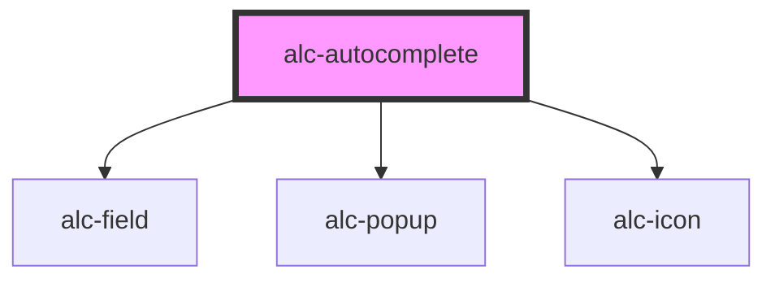

<!-- Auto Generated Below -->

## Properties

| Property        | Attribute        | Description                                               | Type                           | Default      |
| --------------- | ---------------- | --------------------------------------------------------- | ------------------------------ | ------------ |
| `disabled`      | `disabled`       | Desabilita input                                          | `boolean`                      | `false`      |
| `displayKeys`   | `display-keys`   | Indica os atributos dos dados que serão exibidos na lista | `string`                       | `''`         |
| `error`         | `error`          | Indica se houve um erro ao carregar os dados              | `boolean`                      | `false`      |
| `errorMsg`      | `error-msg`      |                                                           | `string`                       | `null`       |
| `hint`          | `hint`           | Mensagem de ajuda                                         | `string`                       | `''`         |
| `items`         | --               | Itens que serão listado no componente                     | `{ [key: string]: string; }[]` | `[]`         |
| `label`         | `label`          | Label do input                                            | `string`                       | `''`         |
| `listDirection` | `list-direction` | Indica o tipo de visualização da lista                    | `"horizontal" \| "vertical"`   | `'vertical'` |
| `loading`       | `loading`        | Indica se os dados estão sendo carregados                 | `boolean`                      | `false`      |
| `placeholder`   | `placeholder`    | Texto dentro do input                                     | `string`                       | `undefined`  |
| `required`      | `required`       | Indica se o input é obrigatório                           | `boolean`                      | `false`      |

## Events

| Event        | Description                                                                                                                              | Type               |
| ------------ | ---------------------------------------------------------------------------------------------------------------------------------------- | ------------------ |
| `alc-change` | Evento emitido sempre que o item selecionado for alterado. O valor emitido será o mesmo que pode ser obtido pelo método `getSelected()`. | `CustomEvent<any>` |

## Methods

### `clearSelected() => Promise<void>`

Limpa o valor selecionado

#### Returns

Type: `Promise<void>`

### `getSelected() => Promise<any>`

Retorna o valor selecionado

#### Returns

Type: `Promise<any>`

### `setSelected(item: any) => Promise<void>`

Define o valor selecionado

#### Parameters

| Name   | Type  | Description |
| ------ | ----- | ----------- |
| `item` | `any` |             |

#### Returns

Type: `Promise<void>`

## Dependencies

### Depends on

- [alc-field](../alc-field)
- [alc-popup](../alc-popup)
- [alc-icon](../alc-icon)

### Graph

----------------------------------------------

Desenvolvido pela Câmara dos Deputados
