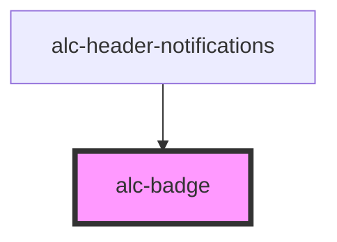

<!-- Auto Generated Below -->

## Properties

| Property   | Attribute  | Description                                                                                                 | Type                                                                                   | Default     |
| ---------- | ---------- | ----------------------------------------------------------------------------------------------------------- | -------------------------------------------------------------------------------------- | ----------- |
| `color`    | `color`    | Define a cor do badge. Pode ser 'primary', 'secondary', 'success', 'warning', 'error', 'info' ou 'neutral'. | `"error" \| "info" \| "neutral" \| "primary" \| "secondary" \| "success" \| "warning"` | `'primary'` |
| `count`    | `count`    | Define se o badge deve ser exibido como um contador.                                                        | `boolean`                                                                              | `false`     |
| `dot`      | `dot`      | Define se o badge deve ser exibido como um ponto (dot) sem conteúdo.                                        | `boolean`                                                                              | `false`     |
| `hidden`   | `hidden`   | Define se o badge deve ser exibido ou não.                                                                  | `boolean`                                                                              | `false`     |
| `label`    | `label`    | O texto a ser exibido dentro do badge (ex: "99+" ou "Novo").                                                | `string`                                                                               | `undefined` |
| `outlined` | `outlined` | Define se o badge deve aparecer com um contorno ao invés de ser preenchido.                                 | `boolean`                                                                              | `false`     |
| `position` | `position` | Define a posição do badge: 'default', 'floating' ou 'inline'.                                               | `"default" \| "floating" \| "inline"`                                                  | `'default'` |
| `pulsate`  | `pulsate`  | Define se o badge deve ter animação de pulsação.                                                            | `boolean`                                                                              | `false`     |

## CSS Custom Properties

| Name                     | Description               |
| ------------------------ | ------------------------- |
| `--bg-color-info`        | Cor de fundo para info    |
| `--bg-color-warning`     | Cor de fundo para warning |
| `--border-color-info`    | Cor de borda para info    |
| `--border-color-warning` | Cor de borda para warning |
| `--text-color-info`      | Cor de texto para info    |
| `--text-color-warning`   | Cor de texto para warning |

## Dependencies

### Used by

 - [alc-header-notifications](../alc-header-notifications)

### Graph

----------------------------------------------

Desenvolvido pela Câmara dos Deputados
