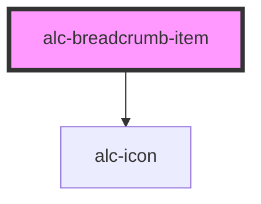

<!-- Auto Generated Below -->

## Properties

| Property   | Attribute   | Description                                                                              | Type     | Default |
| ---------- | ----------- | ---------------------------------------------------------------------------------------- | -------- | ------- |
| `iconName` | `icon-name` | Indica o nome do icone a ser renderizado                                                 | `string` | `null`  |
| `label`    | `label`     | Indica a label do breadcrumb                                                             | `string` | `null`  |
| `url`      | `url`       | Indica a url do link, pode-se usar o slot default para adicionar o elemento de navegação | `string` | `null`  |

## Slots

| Slot | Description                                                                                                                                                   |
| ---- | ------------------------------------------------------------------------------------------------------------------------------------------------------------- |
|      | Slot para adicionar elemento de navegação. Pode ser tanto a tag `<a>` quanto um `<routerlink>` no caso de uso com Vue. Também pode-se usar a propriedade url. |

## Dependencies

### Depends on

- [alc-icon](../alc-icon)

### Graph

----------------------------------------------

Desenvolvido pela Câmara dos Deputados
