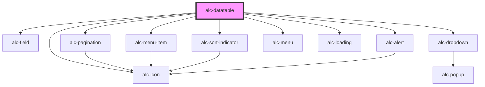

<!-- Auto Generated Below -->

## Properties

| Property     | Attribute     | Description                                                                                                                                                                                               | Type             | Default     |
| ------------ | ------------- | --------------------------------------------------------------------------------------------------------------------------------------------------------------------------------------------------------- | ---------------- | ----------- |
| `data`       | `data`        | Os dados da tabela                                                                                                                                                                                        | `JSON \| string` | `undefined` |
| `deferStart` | `defer-start` | Faz com que o componente aguarde a chamada ao método `start()` para iniciar o DataTable.                                                                                                                  | `boolean`        | `false`     |
| `options`    | `options`     | As opções da tabela                                                                                                                                                                                       | `JSON \| string` | `undefined` |
| `tableId`    | `table-id`    | Define o atributo `id` para a tabela (tag `table`), quando ela é criada automaticamente pelo componente. É você não incluir a tag `table` e usar a opção `stateSave`, é necessário definir esse atributo. | `string`         | `undefined` |

## Events

| Event                   | Description                        | Type               |
| ----------------------- | ---------------------------------- | ------------------ |
| `alc-child-row`         | Ver documentação do DataTables.net | `CustomEvent<any>` |
| `alc-column-sizing`     | Ver documentação do DataTables.net | `CustomEvent<any>` |
| `alc-column-visibility` | Ver documentação do DataTables.net | `CustomEvent<any>` |
| `alc-deselect`          | Ver documentação do DataTables.net | `CustomEvent<any>` |
| `alc-destroy`           | Ver documentação do DataTables.net | `CustomEvent<any>` |
| `alc-draw`              | Ver documentação do DataTables.net | `CustomEvent<any>` |
| `alc-error`             | Ver documentação do DataTables.net | `CustomEvent<any>` |
| `alc-init`              | Ver documentação do DataTables.net | `CustomEvent<any>` |
| `alc-length`            | Ver documentação do DataTables.net | `CustomEvent<any>` |
| `alc-order`             | Ver documentação do DataTables.net | `CustomEvent<any>` |
| `alc-page`              | Ver documentação do DataTables.net | `CustomEvent<any>` |
| `alc-pre-draw`          | Ver documentação do DataTables.net | `CustomEvent<any>` |
| `alc-pre-init`          | Ver documentação do DataTables.net | `CustomEvent<any>` |
| `alc-pre-xhr`           | Ver documentação do DataTables.net | `CustomEvent<any>` |
| `alc-processing`        | Ver documentação do DataTables.net | `CustomEvent<any>` |
| `alc-request-child`     | Ver documentação do DataTables.net | `CustomEvent<any>` |
| `alc-search`            | Ver documentação do DataTables.net | `CustomEvent<any>` |
| `alc-select`            | Ver documentação do DataTables.net | `CustomEvent<any>` |
| `alc-select-blur`       | Ver documentação do DataTables.net | `CustomEvent<any>` |
| `alc-select-items`      | Ver documentação do DataTables.net | `CustomEvent<any>` |
| `alc-select-style`      | Ver documentação do DataTables.net | `CustomEvent<any>` |
| `alc-state-load-params` | Ver documentação do DataTables.net | `CustomEvent<any>` |
| `alc-state-loaded`      | Ver documentação do DataTables.net | `CustomEvent<any>` |
| `alc-state-save-params` | Ver documentação do DataTables.net | `CustomEvent<any>` |
| `alc-user-select`       | Ver documentação do DataTables.net | `CustomEvent<any>` |
| `alc-xhr`               | Ver documentação do DataTables.net | `CustomEvent<any>` |

## Methods

### `getApi() => Promise<any>`

Retorna a API DataTable.

#### Returns

Type: `Promise<any>`

### `getDataTable() => Promise<any>`

Retorna o objeto DataTable.
Por meio do objeto retornado é possível configurar extensões do DataTable.

#### Returns

Type: `Promise<any>`

### `start() => Promise<boolean>`

Inicia o DataTable.
Sempre que `defer-start` for `true`, esse método deve ser chamado para que o componente inicie seu funcionamento.

#### Returns

Type: `Promise<boolean>`

O valor retornado é `true` se o DataTable foi realmente iniciado com a chamada desse método.

## Dependencies

### Depends on

- [alc-field](../alc-field)
- [alc-pagination](../alc-pagination)
- [alc-menu-item](../alc-menu-item)
- [alc-sort-indicator](../alc-sort-indicator)
- [alc-dropdown](../alc-dropdown)
- [alc-icon](../alc-icon)
- [alc-menu](../alc-menu)
- [alc-loading](../alc-loading)
- [alc-alert](../alc-alert)

### Graph

----------------------------------------------

Desenvolvido pela Câmara dos Deputados
