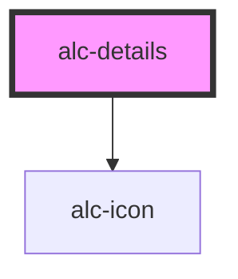

<!-- Auto Generated Below -->

## Properties

| Property               | Attribute  | Description                  | Type      | Default     |
| ---------------------- | ---------- | ---------------------------- | --------- | ----------- |
| `disabled`             | `disabled` | Desativa o componente.       | `boolean` | `undefined` |
| `opened`               | `opened`   | Mantém aberto.               | `boolean` | `false`     |
| `summary` _(required)_ | `summary`  | Insere o summary do details. | `string`  | `undefined` |

## Events

| Event       | Description                              | Type                |
| ----------- | ---------------------------------------- | ------------------- |
| `alc-close` | Evento disparado quando a details fechar | `CustomEvent<null>` |
| `alc-show`  | Evento disparado quando a details abrir  | `CustomEvent<null>` |

## CSS Custom Properties

| Name         | Description              |
| ------------ | ------------------------ |
| `--bg-color` | Cor de fundo do details. |

## Dependencies

### Depends on

- [alc-icon](../alc-icon)

### Graph

----------------------------------------------

Desenvolvido pela Câmara dos Deputados
