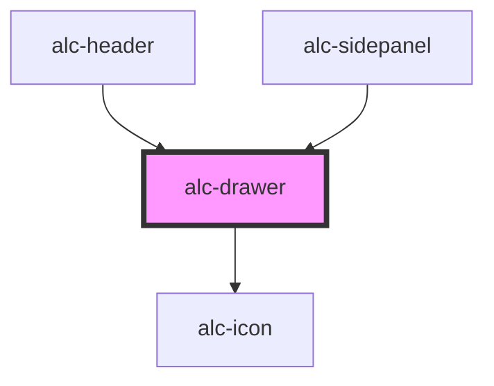

<!-- Auto Generated Below -->

## Properties

| Property         | Attribute          | Description | Type                    | Default |
| ---------------- | ------------------ | ----------- | ----------------------- | ------- |
| `elementToFocus` | `element-to-focus` |             | `HTMLElement \| string` | `null`  |
| `isVisible`      | `is-visible`       |             | `boolean`               | `false` |

## Events

| Event            | Description                                 | Type                |
| ---------------- | ------------------------------------------- | ------------------- |
| `alc-after-hide` | Evento disparado quando o drawer fechou     | `CustomEvent<null>` |
| `alc-after-show` | Evento disparado quando o drawer abriu      | `CustomEvent<null>` |
| `alc-hide`       | Evento disparado quando o drawer vai fechar | `CustomEvent<null>` |
| `alc-show`       | Evento disparado quando o drawer vai abrir  | `CustomEvent<null>` |

## Methods

### `hide() => Promise<boolean>`

Método para fechar o drawer.

#### Returns

Type: `Promise<boolean>`

### `show() => Promise<boolean>`

Método para abrir o drawer.

#### Returns

Type: `Promise<boolean>`

## Dependencies

### Used by

 - [alc-header](../alc-header)
 - [alc-sidepanel](../alc-sidepanel)

### Depends on

- [alc-icon](../alc-icon)

### Graph

----------------------------------------------

Desenvolvido pela Câmara dos Deputados
