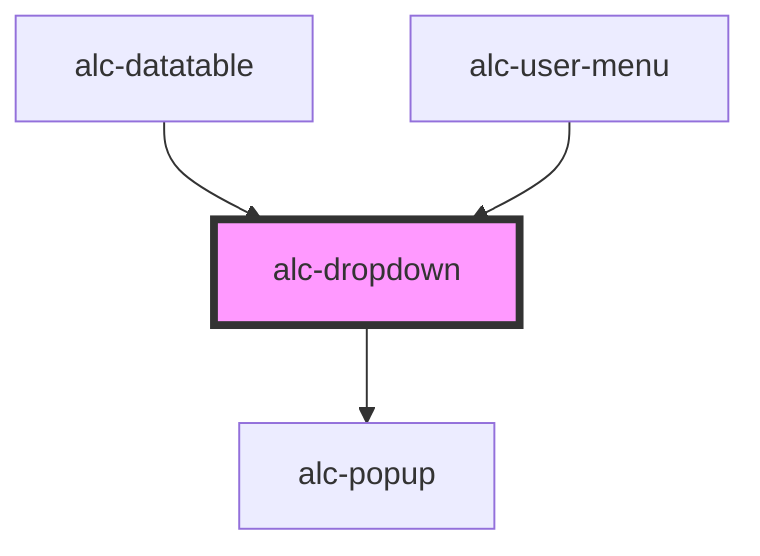

<!-- Auto Generated Below -->

## Properties

| Property | Attribute | Description                                                                                                                                                         | Type      | Default |
| -------- | --------- | ------------------------------------------------------------------------------------------------------------------------------------------------------------------- | --------- | ------- |
| `hideOn` | `hide-on` | Nome do evento que, ao ocorrer no conteúdo do dropdown, vai fazer com que ele seja fechado. Podem ser informados vários eventos, separados por um espaço em branco. | `string`  | `''`    |
| `open`   | `open`    | Indica se o dropdown esta aberto ou não. Pode-se usar essa propriedade em vez dos métodos show/hide.                                                                | `boolean` | `false` |

## Events

| Event            | Description                                   | Type                |
| ---------------- | --------------------------------------------- | ------------------- |
| `alc-after-hide` | Evento disparado quando o dropdown fechou     | `CustomEvent<null>` |
| `alc-after-show` | Evento disparado quando o dropdown abriu      | `CustomEvent<null>` |
| `alc-hide`       | Evento disparado quando o dropdown vai fechar | `CustomEvent<null>` |
| `alc-show`       | Evento disparado quando o dropdown vai abrir  | `CustomEvent<null>` |

## Methods

### `hide() => Promise<boolean>`

Método para fechar o dropdown.

#### Returns

Type: `Promise<boolean>`

O valor retornado é `true` se o dropdown foi realmente oculto com essa chamada ao método.

### `show() => Promise<boolean>`

Método para abrir o dropdown.

#### Returns

Type: `Promise<boolean>`

O valor retornado é `true` se o dropdown foi realmente exibido com essa chamada ao método.

## Slots

| Slot        | Description                                    |
| ----------- | ---------------------------------------------- |
|             | O conteúdo do dropdown.                        |
| `"trigger"` | O disparador do dropdown, usualmente um botão. |

## Dependencies

### Used by

 - [alc-datatable](../alc-datatable)
 - [alc-user-menu](../alc-user-menu)

### Depends on

- [alc-popup](../alc-popup)

### Graph

----------------------------------------------

Desenvolvido pela Câmara dos Deputados
