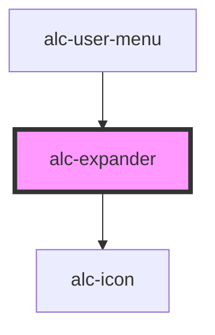

<!-- Auto Generated Below -->

## Properties

| Property             | Attribute    | Description                                                              | Type      | Default     |
| -------------------- | ------------ | ------------------------------------------------------------------------ | --------- | ----------- |
| `hideLabel`          | `hide-label` | Oculta o rótulo do controle, mantendo-o acessível para leitores de tela. | `boolean` | `false`     |
| `label` _(required)_ | `label`      | Rótulo do elemento que controla a abertura e o fechamento do expander.   | `string`  | `undefined` |
| `open`               | `open`       | Define se o expander está aberto ou fechado.                             | `boolean` | `false`     |

## Events

| Event            | Description                                   | Type                |
| ---------------- | --------------------------------------------- | ------------------- |
| `alc-after-hide` | Evento disparado após fechar.                 | `CustomEvent<void>` |
| `alc-after-show` | Evento disparado após abrir.                  | `CustomEvent<void>` |
| `alc-hide`       | Evento disparado antes de fechar. Cancelável. | `CustomEvent<void>` |
| `alc-show`       | Evento disparado antes de abrir. Cancelável.  | `CustomEvent<void>` |

## Methods

### `hide() => Promise<void>`

Fecha o expander programaticamente.

#### Returns

Type: `Promise<void>`

### `show() => Promise<void>`

Abre o expander programaticamente.

#### Returns

Type: `Promise<void>`

## Slots

| Slot        | Description                                                                                                                                                                                                                                                                                          |
| ----------- | ---------------------------------------------------------------------------------------------------------------------------------------------------------------------------------------------------------------------------------------------------------------------------------------------------- |
| `"DEFAULT"` | Slot para o conteúdo do expander.                                                                                                                                                                                                                                                                    |
| `"label"`   | Slot para rótulo do controle. Há opção de adicionar apenas texto por meio da propriedade `label`. Use esse recurso caso seja necessário alguma personalização no HTML referente ao rótulo. Não inclua headings (`h1`, `h2` etc.) nem elementos interativos (`a`, `button`, `input` etc.) nesse slot. |

## Dependencies

### Used by

 - [alc-user-menu](../alc-user-menu)

### Depends on

- [alc-icon](../alc-icon)

### Graph

----------------------------------------------

Desenvolvido pela Câmara dos Deputados
