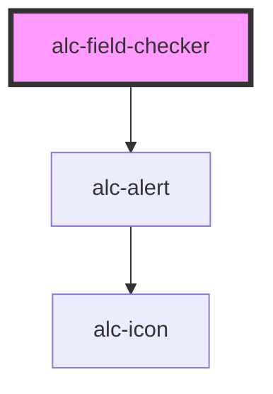

<!-- Auto Generated Below -->

## Properties

| Property        | Attribute         | Description                                    | Type      | Default |
| --------------- | ----------------- | ---------------------------------------------- | --------- | ------- |
| `checkOnSubmit` | `check-on-submit` | Verifica o formulário quando houver submissão. | `boolean` | `false` |

## Dependencies

### Depends on

- [alc-alert](../alc-alert)

### Graph

----------------------------------------------

Desenvolvido pela Câmara dos Deputados
