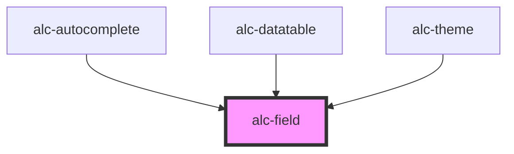

<!-- Auto Generated Below -->

## Properties

| Property   | Attribute   | Description                      | Type      | Default     |
| ---------- | ----------- | -------------------------------- | --------- | ----------- |
| `errorMsg` | `error-msg` | Texto de mensagem de erro.       | `string`  | `''`        |
| `hint`     | `hint`      | Texto de ajuda.                  | `string`  | `''`        |
| `label`    | `label`     | Texto do label do input.         | `string`  | `undefined` |
| `required` | `required`  | Indica se o input é obrigatório. | `boolean` | `false`     |

## Slots

| Slot      | Description                                                                                                                                                                                        |
| --------- | -------------------------------------------------------------------------------------------------------------------------------------------------------------------------------------------------- |
|           | Slot para o controle de formulário. Pode ser um `input` (text, number, password, email etc.), `select` ou `textarea`.                                                                              |
| `"label"` | Slot para o elemento label do campo. Há opção de adicionar apenas o texto por meio da propriedade `label`. Use esse recurso case seja necessário alguma personalização no HTML referente ao label. |

## Dependencies

### Used by

 - [alc-autocomplete](../alc-autocomplete)
 - [alc-datatable](../alc-datatable)
 - [alc-theme](../alc-theme)

### Graph

----------------------------------------------

Desenvolvido pela Câmara dos Deputados
