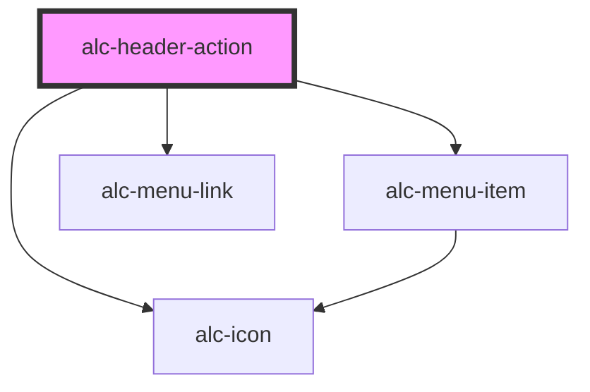

<!-- Auto Generated Below -->

## Properties

| Property   | Attribute   | Description                                                                                 | Type                                               | Default    |
| ---------- | ----------- | ------------------------------------------------------------------------------------------- | -------------------------------------------------- | ---------- |
| `iconName` | `icon-name` | Nome do ícone a ser exibido.                                                                | `string`                                           | `'square'` |
| `url`      | `url`       | URL para a página de suporte. Usado quando a propriedade `variant` é `link` ou `menu-link`. | `string`                                           | `''`       |
| `variant`  | `variant`   | Define o tipo de elemento a ser renderizado.                                                | `"button" \| "link" \| "menu-item" \| "menu-link"` | `'button'` |

## Events

| Event        | Description                                         | Type                                                           |
| ------------ | --------------------------------------------------- | -------------------------------------------------------------- |
| `alc-select` | Evento disparado quando o usuário aciona o suporte. | `CustomEvent<{ originalEvent: KeyboardEvent \| MouseEvent; }>` |

## Slots

| Slot        | Description                         |
| ----------- | ----------------------------------- |
| `"DEFAULT"` | Slot para o conteúdo do componente. |

## Dependencies

### Depends on

- [alc-icon](../alc-icon)
- [alc-menu-item](../alc-menu-item)
- [alc-menu-link](../alc-menu-link)

### Graph

----------------------------------------------

Desenvolvido pela Câmara dos Deputados
