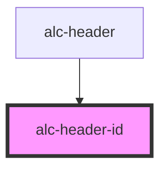

<!-- Auto Generated Below -->

## Properties

| Property               | Attribute     | Description                                                                                                                                  | Type     | Default     |
| ---------------------- | ------------- | -------------------------------------------------------------------------------------------------------------------------------------------- | -------- | ----------- |
| `description`          | `description` | Descrição do sistema. Usualmente, o nome do sistema (se usada a sigla em "name"), o nome de um módulo, ou um complemento ao nome do sistema. | `string` | `undefined` |
| `homeUrl` _(required)_ | `home-url`    | URL para a página inicial do sistema. O nome do sistema será transformado em um link para essa URL.                                          | `string` | `undefined` |
| `name` _(required)_    | `name`        | O nome do sistema. Será mostrado no cabeçalho, que deve estar presente em todas do sistema.                                                  | `string` | `undefined` |

## Events

| Event      | Description                                                                                                                                              | Type                |
| ---------- | -------------------------------------------------------------------------------------------------------------------------------------------------------- | ------------------- |
| `alc-home` | Evento disparado quando o usuário aciona o link para a página inicial. Executar `preventDefault()` evita que a navegação para a página inicial aconteça. | `CustomEvent<null>` |

## Dependencies

### Used by

 - [alc-header](../alc-header)

### Graph

----------------------------------------------

Desenvolvido pela Câmara dos Deputados
