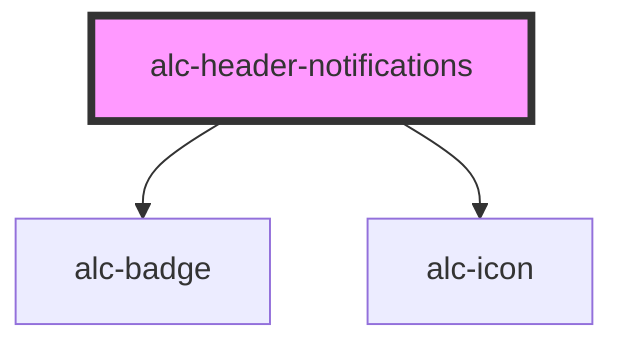

<!-- Auto Generated Below -->

## Properties

| Property        | Attribute       | Description                                                                                                                                 | Type                 | Default    |
| --------------- | --------------- | ------------------------------------------------------------------------------------------------------------------------------------------- | -------------------- | ---------- |
| `notifications` | `notifications` | Número de notificações a serem exibidas no botão.                                                                                           | `number`             | `0`        |
| `url`           | `url`           | URL para a página de notificações. Usado quando a propriedade `variant` é `link`. Se o `variant` for `button`, esse atributo será ignorado. | `string`             | `''`       |
| `variant`       | `variant`       | Define o tipo de elemento a ser renderizado. Pode ser um button ou um link.                                                                 | `"button" \| "link"` | `'button'` |

## Events

| Event       | Description                                                                   | Type                |
| ----------- | ----------------------------------------------------------------------------- | ------------------- |
| `alc-click` | Evento disparado quando o usuário clica nas notificações. Pode ser cancelado. | `CustomEvent<null>` |

## Dependencies

### Depends on

- [alc-badge](../alc-badge)
- [alc-icon](../alc-icon)

### Graph

----------------------------------------------

Desenvolvido pela Câmara dos Deputados
