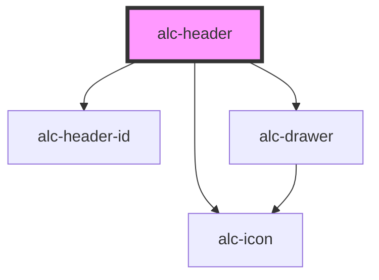

<!-- Auto Generated Below -->

## Properties

| Property               | Attribute     | Description                                                                                                                       | Type     | Default     |
| ---------------------- | ------------- | --------------------------------------------------------------------------------------------------------------------------------- | -------- | ----------- |
| `description`          | `description` | Descrição do sistema. Usualmente, o nome do sistema (se usada a sigla em "name"), descrição ou um complemento ao nome do sistema. | `string` | `undefined` |
| `homeUrl` _(required)_ | `home-url`    | URL para a página inicial do sistema.                                                                                             | `string` | `undefined` |
| `name` _(required)_    | `name`        | O nome do sistema.                                                                                                                | `string` | `undefined` |

## Events

| Event      | Description                                                                                                                                              | Type                |
| ---------- | -------------------------------------------------------------------------------------------------------------------------------------------------------- | ------------------- |
| `alc-home` | Evento disparado quando o usuário aciona o link para a página inicial. Executar `preventDefault()` evita que a navegação para a página inicial aconteça. | `CustomEvent<null>` |

## Slots

| Slot        | Description                                                      |
| ----------- | ---------------------------------------------------------------- |
| `"DEFAULT"` | Slot para skip-links, identificação do ambiente, etc.            |
| `"fixed"`   | Slot para conteúdo fixo, como botões de ações rápidas.           |
| `"support"` | Slot para o conteúdo de apoio, como links de ajuda, contato etc. |
| `"user"`    | Slot para o menu de usuário.                                     |

## Dependencies

### Depends on

- [alc-header-id](../alc-header-id)
- [alc-icon](../alc-icon)
- [alc-drawer](../alc-drawer)

### Graph

----------------------------------------------

Desenvolvido pela Câmara dos Deputados
