<!-- Auto Generated Below -->

## Properties

| Property             | Attribute  | Description                                                                                                                                                                                                                                          | Type      | Default     |
| -------------------- | ---------- | ---------------------------------------------------------------------------------------------------------------------------------------------------------------------------------------------------------------------------------------------------- | --------- | ----------- |
| `flipRtl`            | `flip-rtl` | Define se o ícone deve ser espelhado horizontalmente quando `dir` for `"rtl"`.                                                                                                                                                                       | `boolean` | `false`     |
| `icon`               | `icon`     | Uma combinação de `name` e `src`. Se o valor for entendido como a URL de um `src`, ele definirá a propriedade `src`. Caso contrário, assume-se como o nome de ícone da biblioteca, e define a propriedade `name`.                                    | `string`  | `undefined` |
| `label` _(required)_ | `label`    | Equivalente textual do ícone. Seu uso é semelhante ao atributo `alt` de uma imagem. Esse texto será lido por software leitor de tela, e utilizado no lugar do ícone se por qualquer motivo a imagem não puder ser carregada no navegador.            | `string`  | `undefined` |
| `lazy`               | `lazy`     | Se ativado, a carga do ícone ocorrerá somente quando o componente estiver visível na _viewport_.                                                                                                                                                     | `boolean` | `false`     |
| `name`               | `name`     | Nome do ícone que será mostrado. Deve ser um dos nomes de ícone da biblioteca.                                                                                                                                                                       | `string`  | `undefined` |
| `sanitize`           | `sanitize` | Quando definido como `true`, o conteúdo SVG obtido via HTTP passará por uma limpeza. Conteúdo que contenha algum elemento `<script>` ou atributo que comece com `on`, como `onclick`, será descartado. Sendo descartado, a imagem não será mostrada. | `boolean` | `false`     |
| `src`                | `src`      | Especifica o `src` de um arquivo SVG a ser usado como ícone.                                                                                                                                                                                         | `string`  | `undefined` |

## Dependencies

### Used by

 - [alc-alert](../alc-alert)
 - [alc-autocomplete](../alc-autocomplete)
 - [alc-breadcrumb-item](../alc-breadcrumb-item)
 - [alc-datatable](../alc-datatable)
 - [alc-details](../alc-details)
 - [alc-drawer](../alc-drawer)
 - [alc-expander](../alc-expander)
 - [alc-header](../alc-header)
 - [alc-header-action](../alc-header-action)
 - [alc-header-notifications](../alc-header-notifications)
 - [alc-input-file](../alc-input-file)
 - [alc-menu-item](../alc-menu-item)
 - [alc-menu-item-theme](../alc-menu-item-theme)
 - [alc-modal](../alc-modal)
 - [alc-nav](../alc-nav)
 - [alc-nav-panel](../alc-nav-panel)
 - [alc-pagination](../alc-pagination)
 - [alc-scroll-panel](../alc-scroll-panel)
 - [alc-sidepanel](../alc-sidepanel)
 - [alc-sort-indicator](../alc-sort-indicator)
 - [alc-user](../alc-user)
 - [alc-user-menu](../alc-user-menu)

### Graph

```mermaid
graph TD;
  alc-alert --> alc-icon
  alc-autocomplete --> alc-icon
  alc-breadcrumb-item --> alc-icon
  alc-datatable --> alc-icon
  alc-details --> alc-icon
  alc-drawer --> alc-icon
  alc-expander --> alc-icon
  alc-header --> alc-icon
  alc-header-action --> alc-icon
  alc-header-notifications --> alc-icon
  alc-input-file --> alc-icon
  alc-menu-item --> alc-icon
  alc-menu-item-theme --> alc-icon
  alc-modal --> alc-icon
  alc-nav --> alc-icon
  alc-nav-panel --> alc-icon
  alc-pagination --> alc-icon
  alc-scroll-panel --> alc-icon
  alc-sidepanel --> alc-icon
  alc-sort-indicator --> alc-icon
  alc-user --> alc-icon
  alc-user-menu --> alc-icon
  style alc-icon fill:#f9f,stroke:#333,stroke-width:4px
```

----------------------------------------------

Desenvolvido pela Câmara dos Deputados
