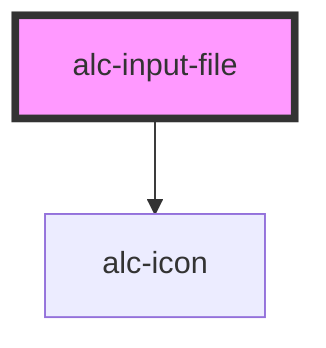

<!-- Auto Generated Below -->

## Properties

| Property               | Attribute     | Description                                                                   | Type                                | Default     |
| ---------------------- | ------------- | ----------------------------------------------------------------------------- | ----------------------------------- | ----------- |
| `accept`               | `accept`      | Define tipos de arquivos específicos para envio. Padrão: Todos.               | `string`                            | `'*/*'`     |
| `buttonType`           | `button-type` | Define o tipo de botão que vai ser renderizado.                               | `"secondary"`                       | `undefined` |
| `disabled`             | `disabled`    | Desativa o componente.                                                        | `boolean`                           | `false`     |
| `iconName`             | `icon-name`   | Ícone a ser exibido no início do input.                                       | `string`                            | `undefined` |
| `idInput` _(required)_ | `id-input`    | Obrigatório. ID do input.                                                     | `string`                            | `undefined` |
| `mode`                 | `mode`        | Modo de visualização do componente. Pode ser 'button', 'input' ou 'dropzone'. | `"button" \| "dropzone" \| "input"` | `'button'`  |
| `multiple`             | `multiple`    | Altera o funcionamento para aceitar vários arquivos.                          | `boolean`                           | `false`     |
| `required`             | `required`    | Indica se é obrigatório.                                                      | `boolean`                           | `false`     |

## Events

| Event               | Description | Type                                |
| ------------------- | ----------- | ----------------------------------- |
| `alc-file-selected` |             | `CustomEvent<AlcFileSelectedEvent>` |

## Methods

### `clear() => Promise<void>`

Limpa os dados do input e a lista de arquivos.

#### Returns

Type: `Promise<void>`

### `getFiles() => Promise<AlcFileWithContent[]>`

Retorna array de arquivos selecionados com seus blobs.

#### Returns

Type: `Promise<AlcFileWithContent[]>`

Lista de arquivos com conteúdo.

## Dependencies

### Depends on

- [alc-icon](../alc-icon)

### Graph

----------------------------------------------

Desenvolvido pela Câmara dos Deputados
