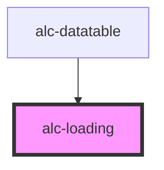

<!-- Auto Generated Below -->

## Properties

| Property  | Attribute | Description                                                                                                                                                                                                 | Type                                                   | Default           |
| --------- | --------- | ----------------------------------------------------------------------------------------------------------------------------------------------------------------------------------------------------------- | ------------------------------------------------------ | ----------------- |
| `active`  | `active`  | Define se o indicador de carregamento aparece na tela. Quando o valor é `true` mostra o componente e quando o valor é `false` oculta.                                                                       | `boolean`                                              | `false`           |
| `endMsg`  | `end-msg` | Texto anunciado ao leitor de tela quando mudar o estado para `active=false`.                                                                                                                                | `string`                                               | `'Finalizado.'`   |
| `label`   | `label`   | Texto mostrado na tela enquanto estiver carregando e também anunciado no leitor de tela quando o estado mudar para `active=true`.                                                                           | `string`                                               | `'Carregando...'` |
| `variant` | `variant` | Define a variação visual do componente: - `'full-screen'`: ocupa a tela inteira. - `'container'`: ocupa o elemento pai. - `'inline'`: utilizado dentro de textos. - `'button'`: utilizado dentro de botões. | `"button" \| "container" \| "full-screen" \| "inline"` | `'full-screen'`   |

## Methods

### `hide() => Promise<boolean>`

Esconde o loading.

#### Returns

Type: `Promise<boolean>`

O valor retornado é `true` se o loading foi realmente oculto com essa chamada ao método.

### `show() => Promise<boolean>`

Exibe o loading.

#### Returns

Type: `Promise<boolean>`

O valor retornado é `true` se o loading foi realmente exibido com essa chamada ao método.

## Dependencies

### Used by

 - [alc-datatable](../alc-datatable)

### Graph

----------------------------------------------

Desenvolvido pela Câmara dos Deputados
