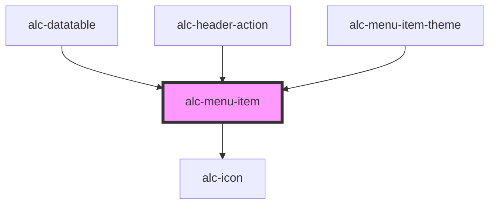

<!-- Auto Generated Below -->

## Properties

| Property   | Attribute  | Description                                                                              | Type                                | Default     |
| ---------- | ---------- | ---------------------------------------------------------------------------------------- | ----------------------------------- | ----------- |
| `checked`  | `checked`  | Indica se o menu-item está ou não marcado. Usado quando `type=checkbox` ou `type=radio`. | `boolean`                           | `false`     |
| `disabled` | `disabled` | Indica se o menu-item está desabilitado.                                                 | `boolean`                           | `false`     |
| `type`     | `type`     | Tipo do menu-item.                                                                       | `"checkbox" \| "normal" \| "radio"` | `'normal'`  |
| `value`    | `value`    | Valor do menu-item, que pode ser utilizado para identificar que item foi selecionado.    | `any`                               | `undefined` |

## Events

| Event        | Description                                        | Type                                                           |
| ------------ | -------------------------------------------------- | -------------------------------------------------------------- |
| `alc-select` | Evento disparado quando o menu-item é selecionado. | `CustomEvent<{ originalEvent: KeyboardEvent \| MouseEvent; }>` |

## Slots

| Slot       | Description                                                                                    |
| ---------- | ---------------------------------------------------------------------------------------------- |
|            | O rótulo do menu-item.                                                                         |
| `"prefix"` | Prefixo do rótulo do menu-item. Geralmente, utilizado para um ícone associado à opção de menu. |
| `"suffix"` | Sufixo do rótulo do menu-item. Geralmente, utilizado para um ícone associado à opção de menu.  |

## Dependencies

### Used by

 - [alc-datatable](../alc-datatable)
 - [alc-header-action](../alc-header-action)
 - [alc-menu-item-theme](../alc-menu-item-theme)

### Depends on

- [alc-icon](../alc-icon)

### Graph

----------------------------------------------

Desenvolvido pela Câmara dos Deputados
