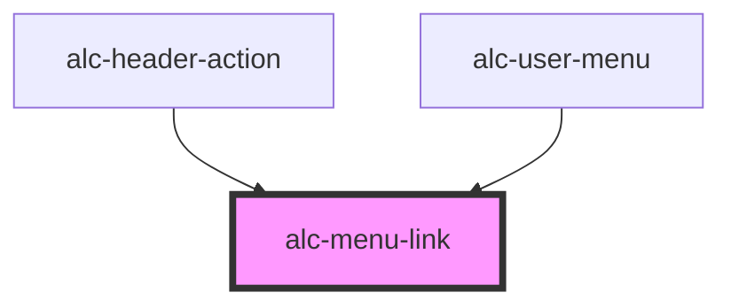

<!-- Auto Generated Below -->

## Properties

| Property   | Attribute  | Description                                                                           | Type      | Default     |
| ---------- | ---------- | ------------------------------------------------------------------------------------- | --------- | ----------- |
| `disabled` | `disabled` | Indica se o menu-link está desabilitado.                                              | `boolean` | `false`     |
| `value`    | `value`    | Valor do menu-link, que pode ser utilizado para identificar que link foi selecionado. | `any`     | `undefined` |

## Events

| Event        | Description                                        | Type                                                           |
| ------------ | -------------------------------------------------- | -------------------------------------------------------------- |
| `alc-select` | Evento disparado quando o menu-link é selecionado. | `CustomEvent<{ originalEvent: KeyboardEvent \| MouseEvent; }>` |

## Slots

| Slot | Description                                                                                       |
| ---- | ------------------------------------------------------------------------------------------------- |
|      | A tag para navegação. Pode ser tanto a tag `<a>` quanto um `<routerlink>` no caso de uso com Vue. |

## Dependencies

### Used by

 - [alc-header-action](../alc-header-action)
 - [alc-user-menu](../alc-user-menu)

### Graph

----------------------------------------------

Desenvolvido pela Câmara dos Deputados
