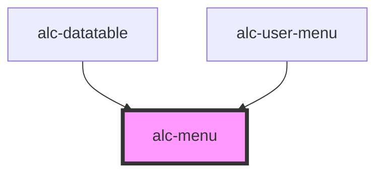

<!-- Auto Generated Below -->

## Methods

### `refresh() => Promise<void>`

#### Returns

Type: `Promise<void>`

## Dependencies

### Used by

 - [alc-datatable](../alc-datatable)
 - [alc-user-menu](../alc-user-menu)

### Graph

----------------------------------------------

Desenvolvido pela Câmara dos Deputados
