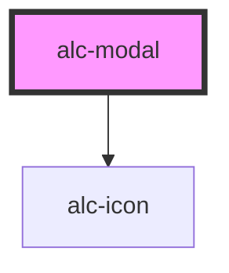

<!-- Auto Generated Below -->

## Properties

| Property              | Attribute               | Description                                     | Type                           | Default |
| --------------------- | ----------------------- | ----------------------------------------------- | ------------------------------ | ------- |
| `headerText`          | `header-text`           | Título da modal                                 | `string`                       | `''`    |
| `open`                | `open`                  | Define se a modal está aberta ou fechada.       | `boolean`                      | `false` |
| `preventOverlayClose` | `prevent-overlay-close` | Previne a modal de fechar ao clicar no overlay. | `boolean`                      | `false` |
| `size`                | `size`                  | Tamanho da modal                                | `"lg" \| "md" \| "sm" \| "xl"` | `'md'`  |

## Events

| Event                  | Description                                                               | Type                                                                                    |
| ---------------------- | ------------------------------------------------------------------------- | --------------------------------------------------------------------------------------- |
| `alc-after-hide`       | Evento disparado quando a modal fechou                                    | `CustomEvent<null>`                                                                     |
| `alc-after-show`       | Evento disparado quando a modal abriu                                     | `CustomEvent<null>`                                                                     |
| `alc-focus-after-hide` | Evento disparado quando a modal fechou e esta pronto para lidar com foco. | `CustomEvent<null>`                                                                     |
| `alc-hide`             | Evento disparado quando a modal vai fechar                                | `CustomEvent<{ from: "header-button" \| "footer-button" \| "keyboard" \| "overlay"; }>` |

## Methods

### `hide() => Promise<boolean>`

Método para fechar modal.

#### Returns

Type: `Promise<boolean>`

O valor retornado é `true` se a modal foi realmente oculta com essa chamada ao método.

### `show() => Promise<boolean>`

Método para abrir modal.

#### Returns

Type: `Promise<boolean>`

O valor retornado é `true` se a modal foi realmente exibida com essa chamada ao método.

## Slots

| Slot       | Description                       |
| ---------- | --------------------------------- |
|            | O conteúdo da modal.              |
| `"footer"` | O conteúdo do rodapé da modal.    |
| `"header"` | O conteúdo do cabeçalho da modal. |

## Dependencies

### Depends on

- [alc-icon](../alc-icon)

### Graph

----------------------------------------------

Desenvolvido pela Câmara dos Deputados
