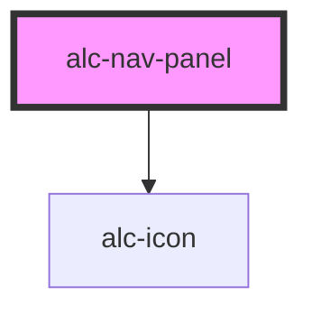

<!-- Auto Generated Below -->

## Properties

| Property | Attribute | Description                                                                                                            | Type      | Default     |
| -------- | --------- | ---------------------------------------------------------------------------------------------------------------------- | --------- | ----------- |
| `open`   | `open`    | Indica se o nav-panel está visível. O valor inicial desse atributo será definido dinamicamente pelo próprio nav-panel. | `boolean` | `undefined` |

## Events

| Event               | Description                                                     | Type                              |
| ------------------- | --------------------------------------------------------------- | --------------------------------- |
| `alc-state-change`  | Evento disparado quando o estado do nav-panel é alterado.       | `CustomEvent<AlcStateEventTypes>` |
| `alc-state-request` | Evento disparado quando o nav-panel precisa recuperar o estado. | `CustomEvent<AlcStateEventTypes>` |

## Methods

### `hide() => Promise<boolean>`

Fecha o nav-panel.

#### Returns

Type: `Promise<boolean>`

O valor retornado é `true` se o nav-panel foi fechado com a chamada do método.

### `show() => Promise<boolean>`

Abre o nav-panel.

#### Returns

Type: `Promise<boolean>`

O valor retornado é `true` se o nav-panel foi exibido com a chamada do método.

## Slots

| Slot        | Description                        |
| ----------- | ---------------------------------- |
| `"DEFAULT"` | Slot para o conteúdo do nav-panel. |

## Dependencies

### Depends on

- [alc-icon](../alc-icon)

### Graph

----------------------------------------------

Desenvolvido pela Câmara dos Deputados
