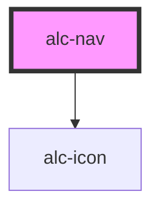

<!-- Auto Generated Below -->

## Methods

### `setSelectedItem(listItem?: HTMLElement) => Promise<void>`

Seleciona o item passado pelo parâmetro. Se nenhum valor for passado, apenas remove o item atualmente selecionado.

#### Parameters

| Name       | Type          | Description |
| ---------- | ------------- | ----------- |
| `listItem` | `HTMLElement` |             |

#### Returns

Type: `Promise<void>`

### `togglePanel(panel: HTMLElement) => Promise<void>`

Abre ou fecha o painel especificado pelo parâmetro.

#### Parameters

| Name    | Type          | Description |
| ------- | ------------- | ----------- |
| `panel` | `HTMLElement` |             |

#### Returns

Type: `Promise<void>`

## Slots

| Slot        | Description                                                                                                                                |
| ----------- | ------------------------------------------------------------------------------------------------------------------------------------------ |
| `"DEFAULT"` | Slot para o conteúdo principal do nav. Tipicamente, os elementos de navegação pelas funcionalidades do sistema.                            |
| `"footer"`  | Slot nomeado para adicionar rodapé no nav. Tipicamente, os elementos de navegação acessórios e configurações, incluindo o seletor de tema. |
| `"header"`  | Slot nomeado para adicionar cabeçalho no nav. Tipicamente, a identificação do usuário logado no sistema.                                   |

## Dependencies

### Depends on

- [alc-icon](../alc-icon)

### Graph

----------------------------------------------

Desenvolvido pela Câmara dos Deputados
