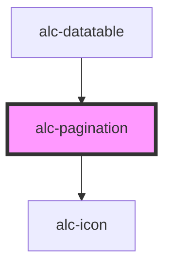

<!-- Auto Generated Below -->

## Properties

| Property      | Attribute      | Description              | Type     | Default |
| ------------- | -------------- | ------------------------ | -------- | ------- |
| `currentPage` | `current-page` | Número da página atual   | `number` | `1`     |
| `totalPages`  | `total-pages`  | Número total de páginas. | `number` | `1`     |

## Events

| Event        | Description                                                 | Type                                                                                                             |
| ------------ | ----------------------------------------------------------- | ---------------------------------------------------------------------------------------------------------------- |
| `alc-change` | Disparado quando ocorre a mudança de uma página para outra. | `CustomEvent<{ from: number; to: number; using: "isFirst" \| "isPrev" \| "isLast" \| "isNext" \| "isSelect"; }>` |

## Dependencies

### Used by

 - [alc-datatable](../alc-datatable)

### Depends on

- [alc-icon](../alc-icon)

### Graph

----------------------------------------------

Desenvolvido pela Câmara dos Deputados
