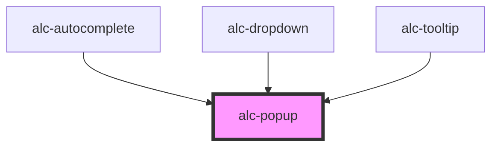

<!-- Auto Generated Below -->

## Properties

| Property    | Attribute   | Description                                                                                                                                                                              | Type                                                                                                                                                                 | Default      |
| ----------- | ----------- | ---------------------------------------------------------------------------------------------------------------------------------------------------------------------------------------- | -------------------------------------------------------------------------------------------------------------------------------------------------------------------- | ------------ |
| `active`    | `active`    | Aciona a abertura do popup.                                                                                                                                                              | `boolean`                                                                                                                                                            | `false`      |
| `arrow`     | `arrow`     | Adiciona arrow no popup.                                                                                                                                                                 | `boolean`                                                                                                                                                            | `false`      |
| `distance`  | `distance`  | Define a distância entre o popup e âncora.                                                                                                                                               | `number`                                                                                                                                                             | `0`          |
| `flip`      | `flip`      | Quando definido como `true`, troca o posicionamento (placement) do popup para mantê-lo visível.                                                                                          | `boolean`                                                                                                                                                            | `false`      |
| `placement` | `placement` | Define o posicionamento do popup.                                                                                                                                                        | `"bottom" \| "bottom-end" \| "bottom-start" \| "left" \| "left-end" \| "left-start" \| "right" \| "right-end" \| "right-start" \| "top" \| "top-end" \| "top-start"` | `'bottom'`   |
| `shift`     | `shift`     | Quando definido como `true`, desloca o popup ao longo do eixo para mantê-lo visível quando cortado.                                                                                      | `boolean`                                                                                                                                                            | `false`      |
| `strategy`  | `strategy`  | Determina como o pop-up é posicionado. A estratégia `absoluta` funciona bem na maioria dos casos. Se o overflow cortar o popup, usar a posição `fixed` muitas vezes pode contornar isso. | `"absolute" \| "fixed"`                                                                                                                                              | `'absolute'` |
| `sync`      | `sync`      | Syncs the popup's width or height to that of the anchor element.                                                                                                                         | `"both" \| "height" \| "width"`                                                                                                                                      | `null`       |

## Slots

| Slot        | Description                                              |
| ----------- | -------------------------------------------------------- |
| `"DEFAULT"` | Slot para o elemento principal do popup.                 |
| `"anchor"`  | Slot que serve como âncora e aciona a abertura do popup. |

## Dependencies

### Used by

 - [alc-autocomplete](../alc-autocomplete)
 - [alc-dropdown](../alc-dropdown)
 - [alc-tooltip](../alc-tooltip)

### Graph

----------------------------------------------

Desenvolvido pela Câmara dos Deputados
