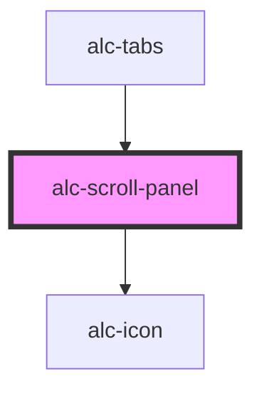

<!-- Auto Generated Below -->

## Properties

| Property          | Attribute   | Description                             | Type          | Default     |
| ----------------- | ----------- | --------------------------------------- | ------------- | ----------- |
| `hasFocus`        | `has-focus` | Define se há foco.                      | `boolean`     | `true`      |
| `scrollToElement` | --          | Define para qual elemento o scroll vai. | `HTMLElement` | `undefined` |

## Dependencies

### Used by

 - [alc-tabs](../alc-tabs)

### Depends on

- [alc-icon](../alc-icon)

### Graph

----------------------------------------------

Desenvolvido pela Câmara dos Deputados
