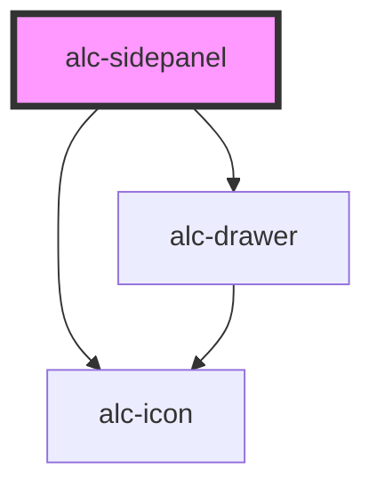

<!-- Auto Generated Below -->

## Properties

| Property  | Attribute | Description                         | Type      | Default |
| --------- | --------- | ----------------------------------- | --------- | ------- |
| `visible` | `visible` | Indica se o sidepanel está visível. | `boolean` | `true`  |

## Events

| Event               | Description                                                     | Type                                             |
| ------------------- | --------------------------------------------------------------- | ------------------------------------------------ |
| `alc-state-change`  | Evento disparado quando o estado do sidepanel é alterado.       | `CustomEvent<{ state: { visible: boolean; }; }>` |
| `alc-state-request` | Evento disparado quando o sidepanel precisa recuperar o estado. | `CustomEvent<{ state: { visible: boolean; }; }>` |

## Methods

### `hide() => Promise<boolean>`

Fecha o sidepanel

#### Returns

Type: `Promise<boolean>`

O valor retornado é `true` se o painel foi dispensado com a chamada do método.

### `show() => Promise<boolean>`

Abre o sidepanel.

#### Returns

Type: `Promise<boolean>`

O valor retornado é `true` se o painel foi exibido com a chamada do método.

## Slots

| Slot        | Description                        |
| ----------- | ---------------------------------- |
| `"DEFAULT"` | Slot para o conteúdo do sidepanel. |

## Dependencies

### Depends on

- [alc-icon](../alc-icon)
- [alc-drawer](../alc-drawer)

### Graph

----------------------------------------------

Desenvolvido pela Câmara dos Deputados
