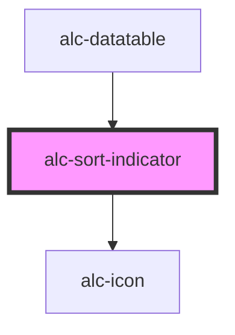

<!-- Auto Generated Below -->

## Properties

| Property  | Attribute | Description               | Type                        | Default  |
| --------- | --------- | ------------------------- | --------------------------- | -------- |
| `sorting` | `sorting` | Define indicação do sort. | `"asc" \| "desc" \| "none"` | `'none'` |

## Dependencies

### Used by

 - [alc-datatable](../alc-datatable)

### Depends on

- [alc-icon](../alc-icon)

### Graph

----------------------------------------------

Desenvolvido pela Câmara dos Deputados
