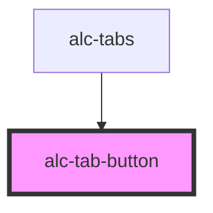

<!-- Auto Generated Below -->

## Properties

| Property           | Attribute  | Description                                                                                                                   | Type      | Default     |
| ------------------ | ---------- | ----------------------------------------------------------------------------------------------------------------------------- | --------- | ----------- |
| `selected`         | `selected` | Indica que a tab está selecionada.                                                                                            | `boolean` | `undefined` |
| `tab` _(required)_ | `tab`      | Um identificador da tab deve ser fornecido para cada `alc-tab`. Isso é usado internamente para referenciar a tab selecionada. | `string`  | `undefined` |

## Events

| Event          | Description                                                                      | Type                            |
| -------------- | -------------------------------------------------------------------------------- | ------------------------------- |
| `alc-click`    | Evento disparado ao clicar em alc-tab-button                                     | `CustomEvent<{ tab: string; }>` |
| `alc-first`    | Evento disparado para indicar que o primeiro alc-tab-button deve ser selecionado | `CustomEvent<null>`             |
| `alc-last`     | Evento disparado para indicar que o último alc-tab-button deve ser selecionado   | `CustomEvent<null>`             |
| `alc-next`     | Evento disparado para indicar que o alc-tab-button seguinte deve ser selecionado | `CustomEvent<null>`             |
| `alc-previous` | Evento disparado para indicar que o alc-tab-button anterior deve ser selecionado | `CustomEvent<null>`             |

## Dependencies

### Used by

 - [alc-tabs](../alc-tabs)

### Graph

----------------------------------------------

Desenvolvido pela Câmara dos Deputados
