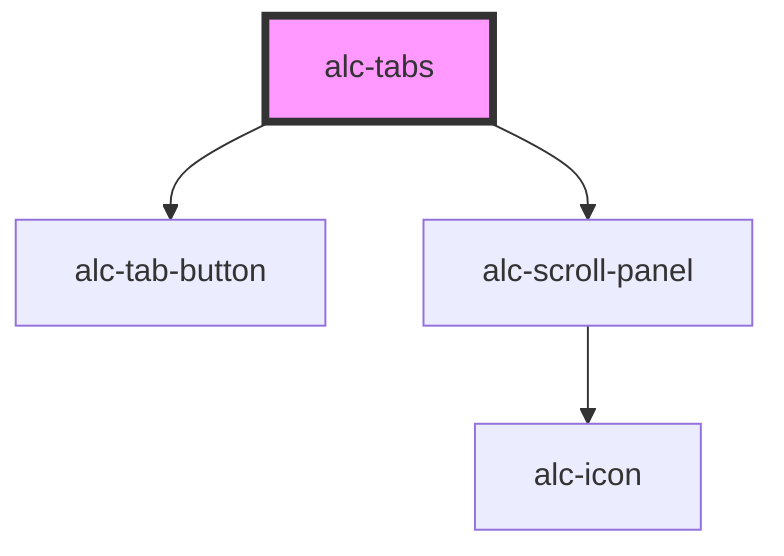

<!-- Auto Generated Below -->

## Properties

| Property   | Attribute  | Description                                   | Type     | Default     |
| ---------- | ---------- | --------------------------------------------- | -------- | ----------- |
| `selected` | `selected` | O identificador da tab atualmente selecionada | `string` | `undefined` |

## Events

| Event        | Description                               | Type                            |
| ------------ | ----------------------------------------- | ------------------------------- |
| `alc-change` | Disparado quando houve uma mudança de tab | `CustomEvent<{ tab: string; }>` |

## Methods

### `select(tab: string | HTMLAlcTabElement) => Promise<boolean>`

Seleciona uma tab pelo valor de sua propriedade `tab` ou pela referência do elemento.

#### Parameters

| Name  | Type                          | Description                                                                                    |
| ----- | ----------------------------- | ---------------------------------------------------------------------------------------------- |
| `tab` | `string \| HTMLAlcTabElement` | A tab a ser selecionada. Se passada como string, deve ser o valor da propriedade `tab` da tab. |

#### Returns

Type: `Promise<boolean>`

## CSS Custom Properties

| Name         | Description                               |
| ------------ | ----------------------------------------- |
| `--bg-color` | Cor de fundo da tab ativa e seu conteúdo. |

## Dependencies

### Depends on

- [alc-tab-button](../alc-tab-button)
- [alc-scroll-panel](../alc-scroll-panel)

### Graph

----------------------------------------------

Desenvolvido pela Câmara dos Deputados
