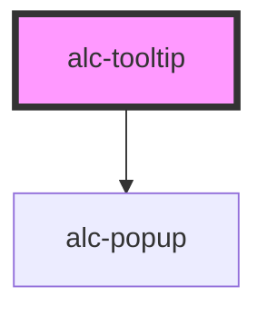

<!-- Auto Generated Below -->

## Properties

| Property    | Attribute   | Description                                                                                                                                                      | Type                                                                                                                                                                 | Default         |
| ----------- | ----------- | ---------------------------------------------------------------------------------------------------------------------------------------------------------------- | -------------------------------------------------------------------------------------------------------------------------------------------------------------------- | --------------- |
| `active`    | `active`    | Indica se o tooltip esta ativo ou não. Pode-se usar essa propriedade em vez dos métodos show/hide.                                                               | `boolean`                                                                                                                                                            | `false`         |
| `content`   | `content`   | Indica o conteudo textual do tooltip. Pode-se usar o slot em vez dessa propriedade.                                                                              | `string`                                                                                                                                                             | `null`          |
| `placement` | `placement` | Define o posicionamento do tooltip.                                                                                                                              | `"bottom" \| "bottom-end" \| "bottom-start" \| "left" \| "left-end" \| "left-start" \| "right" \| "right-end" \| "right-start" \| "top" \| "top-end" \| "top-start"` | `'top'`         |
| `strategy`  | `strategy`  | Define o posicionamento do tooltip.                                                                                                                              | `"absolute" \| "fixed"`                                                                                                                                              | `'absolute'`    |
| `trigger`   | `trigger`   | Define como o tooltip vai ser ativado. Pode ser: `click` , `hover` , `focus` e/ou `manual`. Pode adicionar mais de um, separando por espaço. Ex.: 'hover focus'. | `string`                                                                                                                                                             | `'hover focus'` |

## Events

| Event            | Description                                   | Type                                                                              |
| ---------------- | --------------------------------------------- | --------------------------------------------------------------------------------- |
| `alc-after-hide` | Evento disparado quando o tooltip fechou.     | `CustomEvent<null>`                                                               |
| `alc-after-show` | Evento disparado quando o tooltip abriu       | `CustomEvent<null>`                                                               |
| `alc-hide`       | Evento disparado quando o tooltip vai fechar. | `CustomEvent<{ from: "method" \| "focus" \| "click" \| "keyboard" \| "hover"; }>` |
| `alc-show`       | Evento disparado quando o tooltip vai abrir   | `CustomEvent<{ from: "method" \| "focus" \| "click" \| "hover"; }>`               |

## Methods

### `hide() => Promise<boolean>`

Fecha o tooltip.

#### Returns

Type: `Promise<boolean>`

O valor retornado é `true` se o tooltip foi realmente dispensado com essa chamada ao método.

### `show() => Promise<boolean>`

Exibe o tooltip.

#### Returns

Type: `Promise<boolean>`

O valor retornado é `true` se o tooltip foi realmente exibido com essa chamada ao método.

## Dependencies

### Depends on

- [alc-popup](../alc-popup)

### Graph

----------------------------------------------

Desenvolvido pela Câmara dos Deputados
