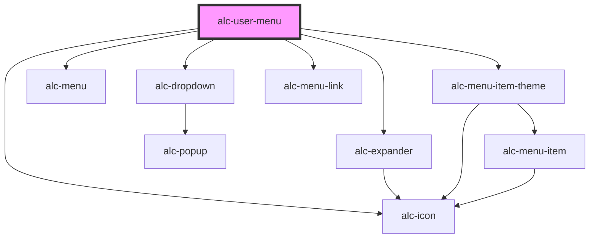

<!-- Auto Generated Below -->

## Properties

| Property                 | Attribute             | Description                                                                             | Type                    | Default     |
| ------------------------ | --------------------- | --------------------------------------------------------------------------------------- | ----------------------- | ----------- |
| `imgSrc`                 | `img-src`             | URL da imagem do usuário. Se não for fornecida, será exibido um ícone padrão.           | `string`                | `''`        |
| `logoutUrl` _(required)_ | `logout-url`          | URL que efetua o logout do usuário. O link "Sair" navegará para essa URL.               | `string`                | `undefined` |
| `name`                   | `name`                | Nome do usuário.                                                                        | `string`                | `'Usuário'` |
| `registrationNumber`     | `registration-number` | Número de matrícula ou ponto do usuário.                                                | `string`                | `''`        |
| `variation`              | `variation`           | Define a variação do menu de usuário. Geralmente, não é recomendado alterar esse valor. | `"desktop" \| "mobile"` | `'desktop'` |

## Events

| Event        | Description                                                                                        | Type               |
| ------------ | -------------------------------------------------------------------------------------------------- | ------------------ |
| `alc-logout` | Evento disparado quando o link "Sair" é acionado. Se cancelado, não navegará para a URL de logout. | `CustomEvent<any>` |

## Dependencies

### Depends on

- [alc-dropdown](../alc-dropdown)
- [alc-icon](../alc-icon)
- [alc-expander](../alc-expander)
- [alc-menu](../alc-menu)
- [alc-menu-item-theme](../alc-menu-item-theme)
- [alc-menu-link](../alc-menu-link)

### Graph

----------------------------------------------

Desenvolvido pela Câmara dos Deputados
