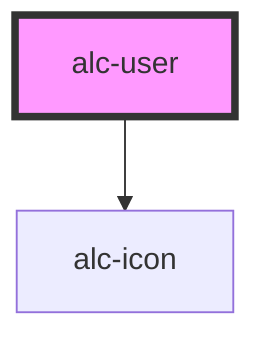

<!-- Auto Generated Below -->

## Properties

| Property             | Attribute             | Description                                                                                   | Type     | Default     |
| -------------------- | --------------------- | --------------------------------------------------------------------------------------------- | -------- | ----------- |
| `imgSrc`             | `img-src`             | Imagem do usuário. Pode ser qualquer valor válido para o atributo `src` da tag `img` do HTML. | `string` | `''`        |
| `logoutUrl`          | `logout-url`          | URL que efetua o logout do usuário.                                                           | `string` | `'#'`       |
| `name`               | `name`                | Nome do usuário.                                                                              | `string` | `'Usuário'` |
| `registrationNumber` | `registration-number` | Número de matrícula ou ponto do usuário.                                                      | `string` | `''`        |

## Events

| Event        | Description                                                                                        | Type               |
| ------------ | -------------------------------------------------------------------------------------------------- | ------------------ |
| `alc-logout` | Evento disparado quando o link "Sair" é acionado. Se cancelado, não navegará para a URL de logout. | `CustomEvent<any>` |

## Slots

| Slot        | Description                                                                                                                                |
| ----------- | ------------------------------------------------------------------------------------------------------------------------------------------ |
| `"DEFAULT"` | Informação adicional do usuário, não estruturada pelo componente, pode ser colocada aqui. Será exibida imediatamente antes do link "Sair". |

## Dependencies

### Depends on

- [alc-icon](../alc-icon)

### Graph

----------------------------------------------

Desenvolvido pela Câmara dos Deputados
